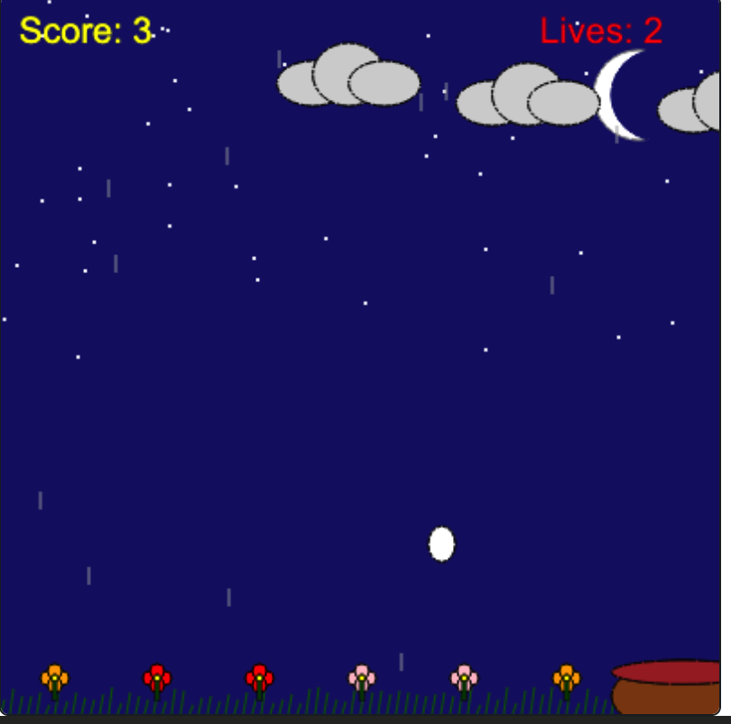

# Egg Catcher Game 🎮

A 2D arcade game developed in Python as part of Stanford University's Code in Place program (2025).  

## Features
- Interactive graphics with scoring system  
- Falling objects, movable basket, bonus elements, and lives system  
- Complete game logic including "Game Over" and restart  
- Built with Object-Oriented Programming principles  

## How to Run
1. Clone this repo or download the `.py` file  
2. Run with Python 3.x
3. Move the mouse to control the basket and catch the eggs!  

## Technologies
- Python  
- Pygame (for graphics)  
- Object-Oriented Programming (OOP)  
